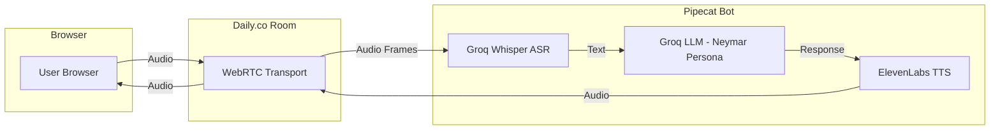

# Pipecat Voice Call with Neymar AI

## Architecture Overview



## Implementation

### 1. Project Structure

```
voice_call_neymar/
    __init__.py
    bot.py              # Main Pipecat bot with pipeline
    runner.py           # FastAPI server to spawn bot instances
    config.py           # Configuration and environment variables
    prompts.py          # Neymar persona prompt (reuse from neymar_voice_app.py)
    requirements.txt    # Dependencies
    .env.example        # Environment variable template
```

### 2. Key Components

**Pipeline Flow:**

1. **Daily Transport** - Handles WebRTC audio I/O with browser
2. **Groq Whisper STT** - Converts user speech to text (low latency)
3. **Groq LLM** - Generates Neymar persona responses using `llama-3.3-70b-versatile`
4. **ElevenLabs TTS** - Converts text to speech using cloned Neymar voice
5. **Audio output** - Streams back to user via Daily

**Critical for Low Latency:**

- Use ElevenLabs streaming mode (`eleven_turbo_v2_5` model)
- Enable VAD (Voice Activity Detection) for turn-taking
- Use Groq's fast inference (sub-200ms LLM response)
- Interrupt handling for natural conversation flow

### 3. Dependencies

```
pipecat-ai[daily,groq,elevenlabs,silero]
python-dotenv
fastapi
uvicorn
aiohttp
```

### 4. Environment Variables Required

```
GROQ_API_KEY=<existing>
ELEVEN_LABS_KEY=<existing>
ELEVEN_LABS_VOICE_ID=<neymar_clone_voice_id>
DAILY_API_KEY=<for creating rooms>
```

**Note:** You'll need a Daily.co API key to create rooms. Free tier available at daily.co.

### 5. Files to Create

| File | Purpose |

| ------------------------------------ | -------------------------------------------------------------- |

| `voice_call_neymar/config.py` | Load env vars, define settings |

| `voice_call_neymar/prompts.py` | Neymar persona prompt (adapted from existing) |

| `voice_call_neymar/bot.py` | Pipecat pipeline: Daily + Groq STT + Groq LLM + ElevenLabs TTS |

| `voice_call_neymar/runner.py` | FastAPI endpoint to create rooms and spawn bots |

| `voice_call_neymar/requirements.txt` | Package dependencies |

| `voice_call_neymar/.env.example` | Template for environment variables |

### 6. Bot Pipeline Structure

The core pipeline in `bot.py`:

```python
pipeline = Pipeline([
    transport.input(),           # Audio from Daily room
    stt,                         # Groq Whisper transcription
    context_aggregator.user(),   # Collect user utterance
    llm,                         # Groq LLM with Neymar prompt
    tts,                         # ElevenLabs streaming TTS
    transport.output(),          # Audio back to Daily room
    context_aggregator.assistant()  # Track conversation
])
```

### 7. Usage Flow

1. User runs `python -m voice_call_neymar.runner`
2. Server starts on `http://localhost:7860`
3. User visits endpoint to get a Daily room URL
4. User clicks link to join voice call in browser
5. Bot joins and enables real-time conversation with Neymar AI

## Questions Resolved

- **ASR**: Groq Whisper API (fast, accurate)
- **LLM**: Groq with llama-3.3-70b-versatile
- **TTS**: ElevenLabs with cloned voice (via `ELEVEN_LABS_VOICE_ID` env var)
- **Transport**: Daily.co WebRTC (browser-based, low latency)

## Additional Notes

- The Neymar persona prompt will be adapted from [neymar_voice_app.py](neymar_voice_app.py) (lines 105-153)
- Emotion tags from the existing prompt may not work with ElevenLabs the same way - will need to test or remove
- Daily.co free tier allows 10,000 participant minutes/month
