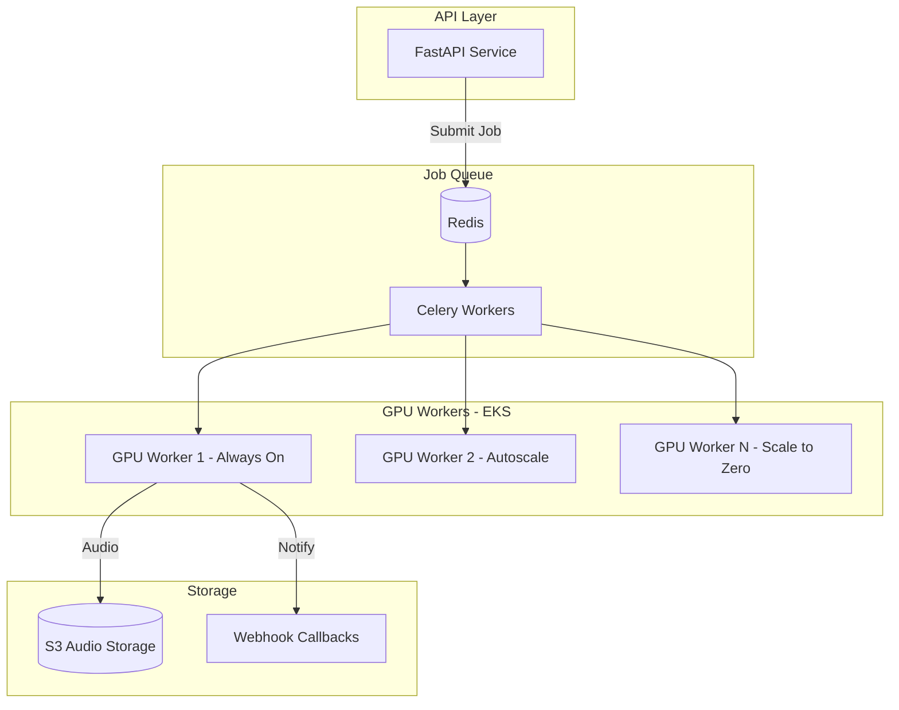

# Production Voice Service Architecture

## Current State Analysis

The current [`voice-service/src/inference/engine.py`](voice-service/src/inference/engine.py) has:

- Single-threaded queue processing (`launch_thread_safe_queue`)
- No request batching (batch_size=1 hardcoded)
- Synchronous generation blocking API threads
- No job persistence or retry logic
- No autoscaling support

## Architecture Overview




## Capacity Estimates (A10G 24GB)

| Metric | Value ||--------|-------|| Model VRAM | ~2GB || Generation speed | ~80 tokens/sec || Avg request (10s audio) | ~3-4 sec processing || **Single GPU throughput** | ~15-20 req/min || **Batched (batch=4)** | ~40-50 req/min || **50K concurrent (1 req/5min each)** | ~10K req/min peak || **GPUs needed (batched)** | ~12-15 A10G at peak |

## Implementation Plan

### Phase 1: Async Job Queue Infrastructure

Add Redis + Celery for async job processing:

1. **New file**: `voice-service/src/queue/tasks.py` - Celery task definitions
2. **New file**: `voice-service/src/queue/worker.py` - GPU worker process  
3. **Update**: [`voice-service/src/api/routes.py`](voice-service/src/api/routes.py) - Add async endpoints
4. **Update**: [`voice-service/src/config.py`](voice-service/src/config.py) - Add Redis/Celery config

### Phase 2: Request Batching

Implement dynamic batching to maximize GPU utilization:

1. **New file**: `voice-service/src/inference/batcher.py` - Request batching logic
2. **Update**: [`voice-service/src/inference/engine.py`](voice-service/src/inference/engine.py) - Batch-aware generation
3. Batch window: 100ms, max batch size: 4-8

### Phase 3: EKS Deployment with Autoscaling

1. **New file**: `voice-service/k8s/deployment.yaml` - GPU deployment
2. **New file**: `voice-service/k8s/keda-scaler.yaml` - KEDA autoscaling based on Redis queue length
3. **New file**: `voice-service/k8s/hpa.yaml` - HPA for API pods
4. Hybrid scaling: 1 warm GPU + 0-N overflow workers

### Phase 4: Cost Optimization

1. Preemptible/Spot instances for overflow workers
2. Model caching to reduce cold start time
3. Connection pooling for Redis
4. Audio result caching in S3 with TTL

## Key Files to Create/Modify

| File | Action | Purpose ||------|--------|---------|| `src/queue/__init__.py` | Create | Queue module init || `src/queue/celery_app.py` | Create | Celery configuration || `src/queue/tasks.py` | Create | TTS generation task || `src/queue/callbacks.py` | Create | Webhook/polling callbacks || `src/inference/batcher.py` | Create | Dynamic request batching || `src/api/routes.py` | Modify | Add `/v1/audio/speech/async` || `src/api/schemas.py` | Modify | Add async request/response schemas || `src/config.py` | Modify | Add queue config || `k8s/` | Create | Kubernetes manifests || `docker-compose.prod.yml` | Create | Production compose with Redis |

## New API Endpoints

```javascript
POST /v1/audio/speech/async
  -> Returns: { job_id, status_url, estimated_seconds }

GET /v1/jobs/{job_id}
  -> Returns: { status, audio_url?, error? }

POST /v1/audio/speech/batch
  -> Accepts: [{ text, voice_id }, ...]
  -> Returns: { batch_id, job_ids: [...] }
```


## Dependencies to Add

```toml
# pyproject.toml additions
celery = "^5.3"
redis = "^5.0"
flower = "^2.0"  # Celery monitoring
boto3 = "^1.34"  # S3 for audio storage


```