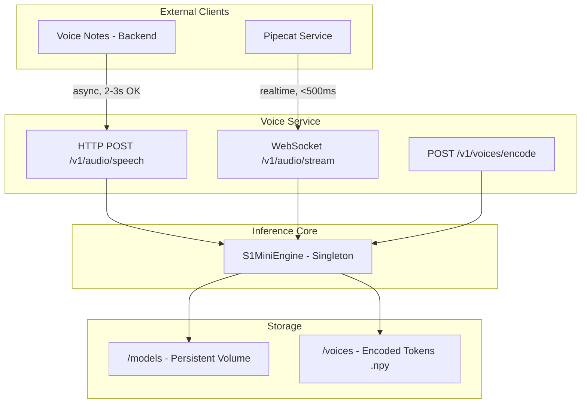

# Voice Service Production Fixes

## Summary

Fix the streaming bug, add WebSocket for real-time, add voice encoding script, and ensure easy Pipecat integration via HTTP/WebSocket endpoints.---

## Current Issues

1. **Streaming is broken** - Provider collects ALL chunks before yielding (defeats streaming)
2. **No WebSocket** - Pipecat needs WebSocket for real-time voice calls  
3. **No voice encoding endpoint** - Need to pre-encode reference audio to .npy tokens
4. **Dockerfile copies fish_speech** - Should require pip package instead
5. **No load/integration tests** - Missing production validation

---

## Architecture



---

## Changes

### 1. Fix True Streaming in Provider

**File:** [`src/providers/s1_mini.py`](voice-service/src/providers/s1_mini.py)**Problem:** Line 136 does `return list(self._engine.generate(...))` which waits for ALL chunks.**Fix:** Use thread-safe queue to yield chunks as generated:

```python
async def synthesize(..., streaming: bool = False):
    if streaming:
        chunk_queue = queue.Queue()
        
        def run_streaming():
            for segment in self._engine.generate(..., streaming=True):
                chunk_queue.put(("chunk", segment))
            chunk_queue.put(("done", None))
        
        loop.run_in_executor(None, run_streaming)
        
        while True:
            msg_type, data = await loop.run_in_executor(None, chunk_queue.get)
            if msg_type == "done":
                break
            yield self._to_pcm16(data)
```


### 2. Add WebSocket Endpoint

**File:** [`src/api/routes.py`](voice-service/src/api/routes.py)

```python
from fastapi import WebSocket, WebSocketDisconnect

@router.websocket("/v1/audio/stream")
async def websocket_tts(websocket: WebSocket):
    await websocket.accept()
    provider = websocket.app.state.provider
    
    try:
        while True:
            data = await websocket.receive_json()
            text = data.get("text", "")
            voice = data.get("voice", "default")
            
            async for chunk in provider.synthesize(
                text=text,
                voice_id=voice if voice != "default" else None,
                format="pcm",
                streaming=True,
            ):
                await websocket.send_bytes(chunk)
            
            await websocket.send_json({"type": "done"})
    except WebSocketDisconnect:
        pass
```


### 3. Add Voice Encoding Endpoint

**File:** [`src/api/routes.py`](voice-service/src/api/routes.py)Encode reference audio to .npy tokens for fast inference:

```python
@router.post("/v1/voices/encode")
async def encode_voice(
    voice_id: str = Form(...),
    transcript: str = Form(...),
    audio: UploadFile = File(...),
    provider: TTSProvider = Depends(get_provider),
):
    audio_bytes = await audio.read()
    tokens = provider._engine.encode_reference(audio_bytes)
    
    # Save to voices directory
    voice_path = Path("voices") / f"{voice_id}.npy"
    np.save(voice_path, tokens)
    
    # Save transcript
    (Path("voices") / f"{voice_id}.txt").write_text(transcript)
    
    return {"voice_id": voice_id, "tokens_shape": tokens.shape}
```


### 4. Add Voice Cache (Pre-encoded tokens)

**New File:** `src/core/voice_cache.py`

```python
class VoiceCache:
    def __init__(self, voices_dir: Path = Path("voices")):
        self._dir = voices_dir
        self._cache: dict[str, tuple[np.ndarray, str]] = {}
    
    def load_all(self) -> None:
        for npy_file in self._dir.glob("*.npy"):
            voice_id = npy_file.stem
            tokens = np.load(npy_file)
            txt_file = npy_file.with_suffix(".txt")
            transcript = txt_file.read_text() if txt_file.exists() else ""
            self._cache[voice_id] = (tokens, transcript)
    
    def get(self, voice_id: str) -> tuple[np.ndarray, str] | None:
        return self._cache.get(voice_id)
```


### 5. Update Dockerfile

**File:** [`Dockerfile`](voice-service/Dockerfile)Remove fish_speech copy, require pip package:

```dockerfile
# Remove these lines:
# COPY fish_speech/ ./fish_speech/
# ENV VOICE_FISH_SPEECH_PATH=/app/fish_speech

# Add fish-speech as pip dependency
RUN pip install fish-speech

# Mount points for persistent storage
VOLUME ["/app/checkpoints", "/app/voices"]
```


### 6. Update docker-compose.yml

**File:** [`docker-compose.yml`](voice-service/docker-compose.yml)

```yaml
volumes:
    - ./checkpoints:/app/checkpoints:ro  # Model weights
    - ./voices:/app/voices:rw            # Encoded voice tokens
```


### 7. Add Load Tests

**New File:** `tests/test_load.py`

```python
import asyncio
import httpx
import time

async def test_concurrent_requests():
    """Test 10 concurrent requests don't deadlock."""
    async with httpx.AsyncClient(base_url="http://localhost:8000") as client:
        tasks = [
            client.post("/v1/audio/speech", json={
                "input": f"Test message {i}",
                "voice": "default"
            }, timeout=30)
            for i in range(10)
        ]
        results = await asyncio.gather(*tasks, return_exceptions=True)
        
        errors = [r for r in results if isinstance(r, Exception)]
        assert len(errors) == 0

async def test_streaming_latency():
    """Measure time to first byte."""
    async with httpx.AsyncClient(base_url="http://localhost:8000") as client:
        start = time.time()
        first_chunk_time = None
        
        async with client.stream("POST", "/v1/audio/speech", json={
            "input": "Hello world",
            "voice": "default",
            "stream": True
        }) as response:
            async for chunk in response.aiter_bytes():
                if first_chunk_time is None:
                    first_chunk_time = time.time() - start
                break
        
        assert first_chunk_time < 2.0  # TTFB under 2 seconds
```


### 8. Add Integration Tests

**New File:** `tests/test_integration.py`

```python
import pytest
from fastapi.testclient import TestClient
from fastapi.websockets import WebSocket

def test_websocket_tts(client):
    """WebSocket endpoint streams audio."""
    with client.websocket_connect("/v1/audio/stream") as ws:
        ws.send_json({"text": "Hello", "voice": "default"})
        
        chunks = []
        while True:
            try:
                data = ws.receive()
                if isinstance(data, dict) and data.get("type") == "done":
                    break
                chunks.append(data)
            except:
                break
        
        assert len(chunks) > 0

def test_voice_encoding(client):
    """Encode voice to .npy tokens."""
    with open("test_audio.wav", "rb") as f:
        response = client.post(
            "/v1/voices/encode",
            data={"voice_id": "test", "transcript": "Hello"},
            files={"audio": f}
        )
    assert response.status_code == 200
    assert "tokens_shape" in response.json()
```

---

## Files to Modify/Create

| File | Action | Description ||------|--------|-------------|| [`src/providers/s1_mini.py`](voice-service/src/providers/s1_mini.py) | Modify | Fix streaming to yield as generated || [`src/api/routes.py`](voice-service/src/api/routes.py) | Modify | Add WebSocket endpoint, voice encode endpoint || [`src/core/voice_cache.py`](voice-service/src/core/voice_cache.py) | Create | Cache for pre-encoded voice tokens || [`src/config.py`](voice-service/src/config.py) | Modify | Add voices_path config || [`Dockerfile`](voice-service/Dockerfile) | Modify | Remove fish_speech copy, add pip install || [`docker-compose.yml`](voice-service/docker-compose.yml) | Modify | Add voices volume mount || [`tests/test_load.py`](voice-service/tests/test_load.py) | Create | Concurrent request tests || [`tests/test_integration.py`](voice-service/tests/test_integration.py) | Create | WebSocket and encoding tests || [`pyproject.toml`](voice-service/pyproject.toml) | Modify | Add websockets dependency |---

## Demo Requirements

| Use Case | Transport | Latency | What's Needed ||----------|-----------|---------|---------------|| Voice Notes | HTTP POST | 2-3s OK | Fix streaming, works now || Pipecat Calls | WebSocket | <500ms TTFB | Add WebSocket endpoint |---

## NOT Building (Per Roadmap)