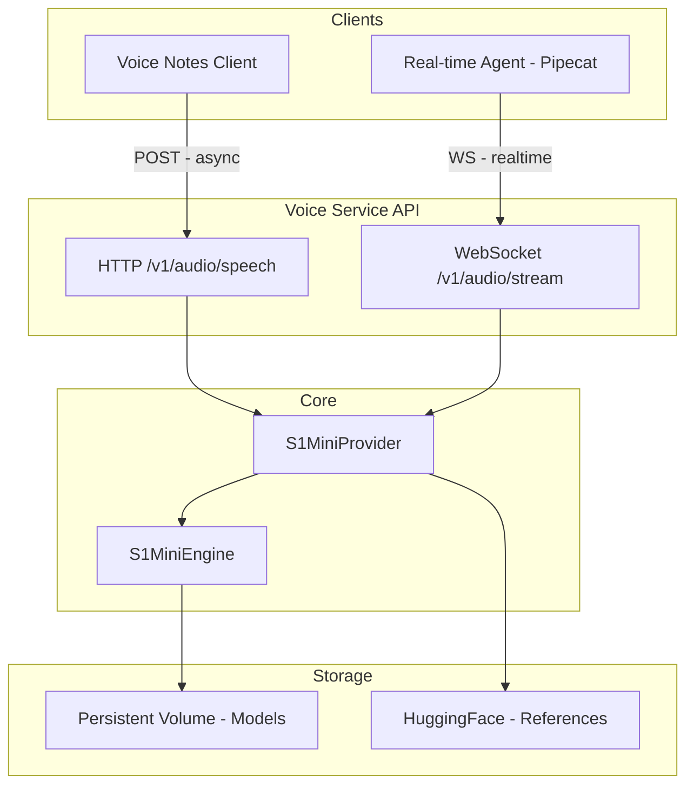

# Voice Service Production Fixes

## Current State Analysis

**Streaming IS partially implemented but BROKEN:**

- Engine correctly yields chunks as generated (line 269 in `engine.py`)
- BUT provider collects ALL chunks into a list BEFORE yielding (line 136-150 in `s1_mini.py`: `return list(...)`)
- This defeats streaming - client waits for full generation

**No queue needed for demo:**

- GPU inference is synchronous and single-threaded anyway
- Batching exists but not integrated into routes
- For demo: single request at a time is fine

---

## Architecture



---

## Changes Required

### 1. Fix True Streaming in Provider

**File:** [`src/providers/s1_mini.py`](voice-service/src/providers/s1_mini.py)Problem: `list(self._engine.generate(...))` collects all before yielding.Fix: Use a thread-safe queue to yield chunks as they're generated:

```python
async def synthesize(..., streaming: bool = False) -> AsyncIterator[bytes]:
    if streaming:
        # Use queue to yield as generated
        chunk_queue = queue.Queue()
        def run_streaming():
            for segment in self._engine.generate(..., streaming=True):
                chunk_queue.put(segment)
            chunk_queue.put(None)  # Sentinel
        
        executor.submit(run_streaming)
        while True:
            chunk = await loop.run_in_executor(None, chunk_queue.get)
            if chunk is None:
                break
            yield self._to_pcm16(chunk)
```


### 2. Add WebSocket Endpoint for Pipecat

**File:** [`src/api/routes.py`](voice-service/src/api/routes.py)Add WebSocket endpoint that Pipecat can connect to:

```python
@router.websocket("/v1/audio/stream")
async def websocket_tts(websocket: WebSocket):
    await websocket.accept()
    while True:
        data = await websocket.receive_json()
        text = data.get("text")
        async for chunk in provider.synthesize(text, streaming=True, format="pcm"):
            await websocket.send_bytes(chunk)
        await websocket.send_json({"done": True})
```


### 3. Persistent Volume for Models

**File:** [`docker-compose.yml`](voice-service/docker-compose.yml)Already configured correctly:

```yaml
volumes:
    - ./checkpoints:/app/checkpoints:ro
```

Update Dockerfile to NOT copy models, just mount them:

- Remove model download on startup by default
- Use `VOICE_S1_CHECKPOINT_PATH=/app/checkpoints/openaudio-s1-mini`

### 4. Remove fish_speech Copy from Dockerfile

**File:** [`Dockerfile`](voice-service/Dockerfile)Current Dockerfile tries to copy fish_speech. Change to:

- Require `fish-speech` as pip package
- Remove COPY fish_speech lines
- Remove VOICE_FISH_SPEECH_PATH env var

### 5. Add Load Testing

**File:** `tests/test_load.py` (new)Simple load tests:

- Concurrent HTTP requests (5, 10, 20)
- Measure latency percentiles
- Memory usage tracking

### 6. Add Integration Tests

**File:** `tests/test_integration.py` (new)

- WebSocket connection test
- Streaming latency test (time to first chunk)
- End-to-end TTS test

---

## Demo Requirements

### Async Voice Notes (HTTP)

- **Latency tolerance:** 2-10 seconds OK
- **What's needed:** Current HTTP endpoint, just fix streaming
- **Queue:** Not needed for demo

### Real-time Calls (WebSocket/Pipecat)

- **Latency requirement:** <500ms to first audio chunk
- **What's needed:** WebSocket endpoint, true streaming
- **Queue:** Not needed for demo (single GPU handles one at a time)

---

## Files to Modify

| File | Change ||------|--------|| [`src/providers/s1_mini.py`](voice-service/src/providers/s1_mini.py) | Fix streaming to yield as generated || [`src/api/routes.py`](voice-service/src/api/routes.py) | Add WebSocket `/v1/audio/stream` endpoint || [`Dockerfile`](voice-service/Dockerfile) | Remove fish_speech copy, require pip package || [`docker-compose.yml`](voice-service/docker-compose.yml) | Simplify, ensure volume mount only || [`env.example.txt`](voice-service/env.example.txt) | Update with cleaner config || `tests/test_load.py` | New: load testing || `tests/test_integration.py` | New: integration tests with WebSocket |---

## What We're NOT Doing (Avoiding Over-engineering)

- No Redis/Celery queue (not needed for demo)
- No complex batching (single GPU, sequential is fine)